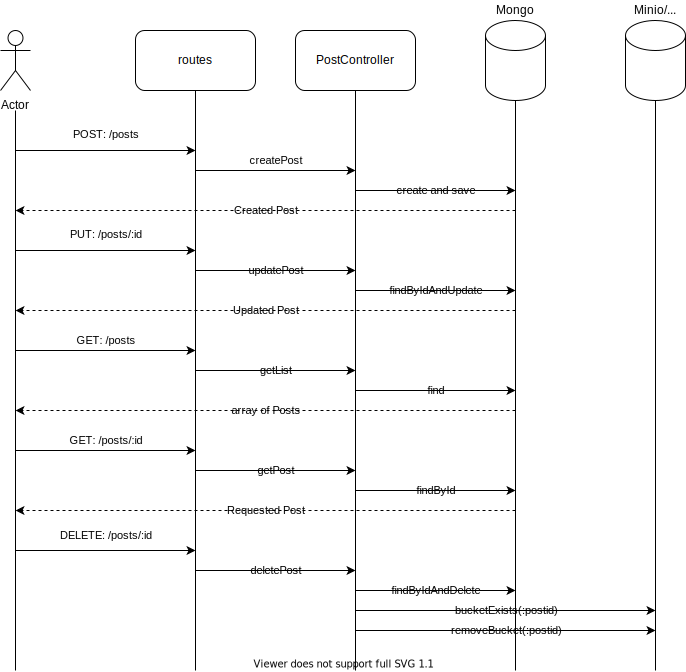
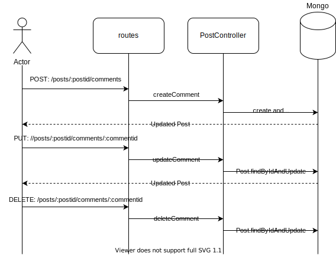
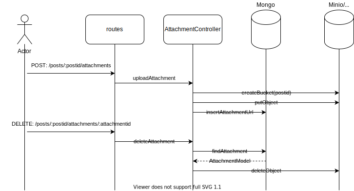

# Donkey assessment

## Requirements
1. Nodejs
2. Docker

## Description
This API supports:
* create, read, list, update and delete on a post
* create, read, and delete of comments on a post
* uploading an attachment on a post is implemented but not functioning correctly

## UML diagrams

### Entity models

### Sequence diagrams
#### Posts

#### Comments

#### Attachment

## Run locally
* `docker-compose up -d [mongo/minio]`
    * This will start a mongo and/or minio container
* `npm start`
    * This will start the API application
  
### Postman collection 
The API can be tested with the sample requests in the postman collection, which can be found in:
* `postman\donkey-assignment.postman_collection.json`