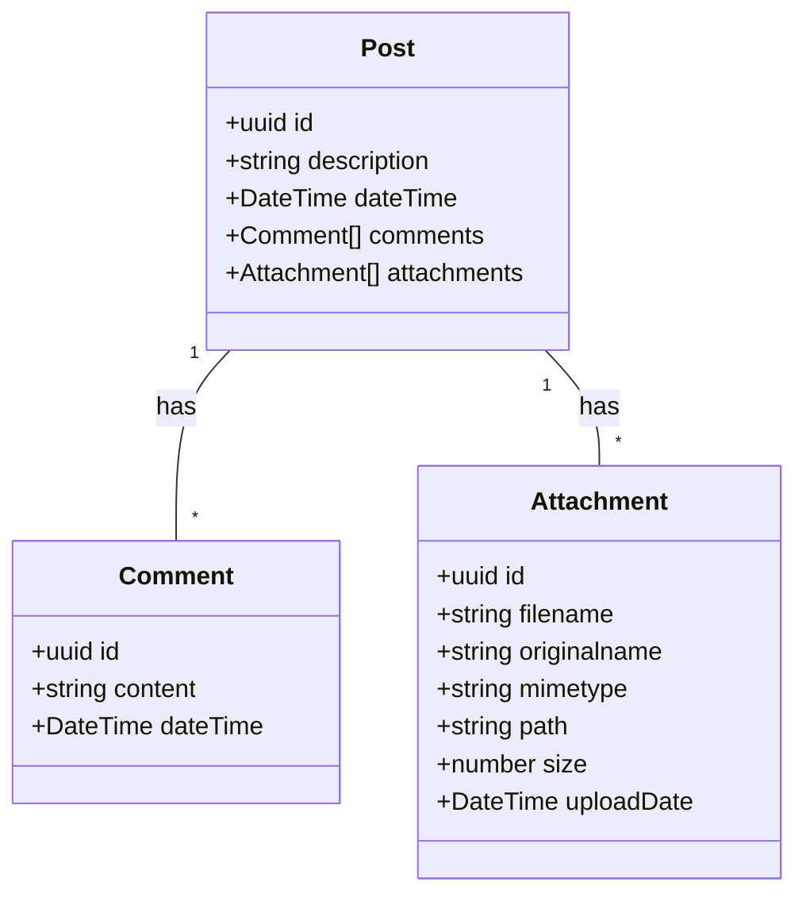

# Timeline API

## Description

A simple backend service for timeline posts built with NestJS and TypeScript. Users can create posts and add comments to them.

## Questions About the Assignment

- What kind of UML diagram would be most useful? I went with a basic class diagram to show the data structure.
- The assignment mentions attachments as a bonus feature - would you prefer a specific approach for handling files?
- Any specific MongoDB setup preferences (hosted vs local, specific ODM, etc.)?

### Core Features

- **Post Management**: Create, read, update, and delete posts on a timeline
- **Attachment Handling**: Support for photos, videos, and PDF documents
- **Interactive Comments**: Users can comment on posts

## System Architecture

### UML Diagram



## Project Setup

```bash
$ npm install
```

## MongoDB Setup

The application uses MongoDB for data storage. A docker-compose.yml file is provided at the root of the project to easily set up MongoDB:

```bash
# From the root directory of the project
$ docker-compose up -d
```

This will start a MongoDB instance at `mongodb://localhost:27017/timeline`.

## Running the Application

```bash
# development mode
$ npm run start

# watch mode (recommended for development)
$ npm run start:dev

# production mode
$ npm run start:prod
```

Make sure MongoDB is running before starting the application.

## Testing

```bash
# unit tests
$ npm run test

# e2e tests
$ npm run test:e2e

# test coverage
$ npm run test:cov
```

## Design Decisions and Architecture

### Database Selection

The application uses MongoDB (NoSQL) because:

- It provides flexibility for schema evolution as the application grows
- The data structure (posts → comments, posts → attachments) works well with document-based storage
- Good performance for read-heavy operations typical in timeline applications
- Native support for nested documents, ideal for comments within posts

## Why NestJS Framework

NestJS was selected for this project for several key reasons:

- **Modular Architecture**: Provides a clean, organized structure for controllers, services, and modules
- **TypeScript Integration**: Enables strong typing and better developer experience
- **Dependency Injection**: Simplifies testing and promotes loose coupling between components
- **API Documentation**: Built-in Swagger support for easy API documentation
- **MongoDB Support**: Works well with MongoDB through TypeORM or Mongoose adapters

## Future Improvements

- **OpenAPI Specification**: Generate complete OpenAPI documentation for all endpoints
- **Media Processing**: Add automatic image resizing and video transcoding
- **Performance Optimization**: Implement caching for frequently accessed content
- Add authentication to mongodb
- Pagination or lazy loading optimization for posts / comments.
- Add minimalistic UI for testing, build using [htmx](https://htmx.org/).
- Add external storage for attachments.
- Use [fastify](https://github.com/fastify/fastify) for better (http) performance
- Add user entity, so a post has an owner.
