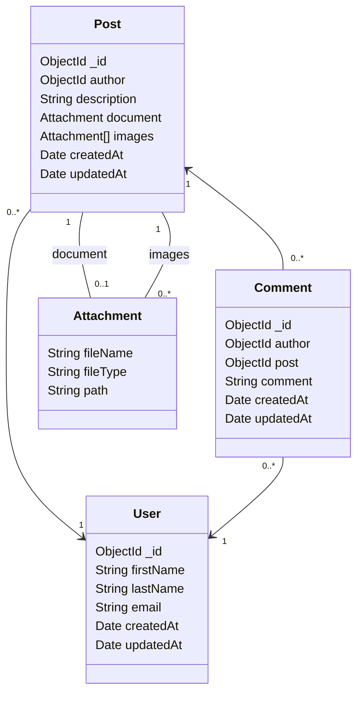

```mermaid

classDiagram

class User {
    ObjectId _id
    String firstName
    String lastName
    String email
    Date createdAt
    Date updatedAt
}

class Post {
    ObjectId _id
    ObjectId author
    String description
    Attachment document
    Attachment[] images
    Date createdAt
    Date updatedAt
}

class Comment {
    ObjectId _id
    ObjectId author
    ObjectId post
    String comment
    Date createdAt
    Date updatedAt
}

class Attachment {
    String fileName
    String fileType
    String path
}

Post "0..*" --> "1" User
Post "1" <-- "0..*" Comment
Post "1" -- "0..1" Attachment: document
Post "1" -- "0..*" Attachment: images
Comment "0..*" --> "1" User
```
