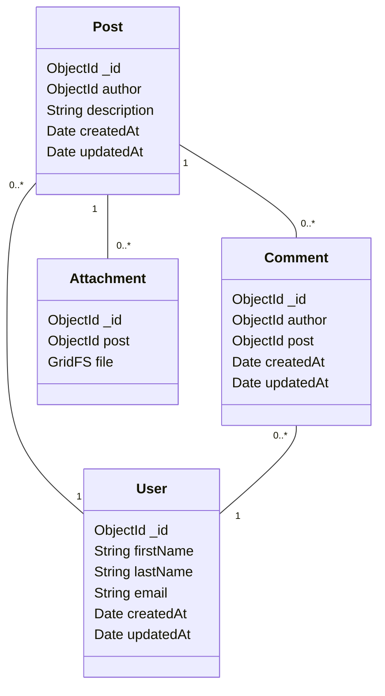

```mermaid

classDiagram

class User {
    ObjectId _id
    String firstName
    String lastName
    String email
    Date createdAt
    Date updatedAt
}

class Post {
    ObjectId _id
    ObjectId author
    String description
    Date createdAt
    Date updatedAt
}

class Comment {
    ObjectId _id
    ObjectId author
    ObjectId post
    Date createdAt
    Date updatedAt
}

class Attachment {
    ObjectId _id
    ObjectId post
    GridFS file
}

Post "0..*" -- "1" User
Post "1" -- "0..*" Comment
Post "1" -- "0..*" Attachment
Comment "0..*" -- "1" User
```
